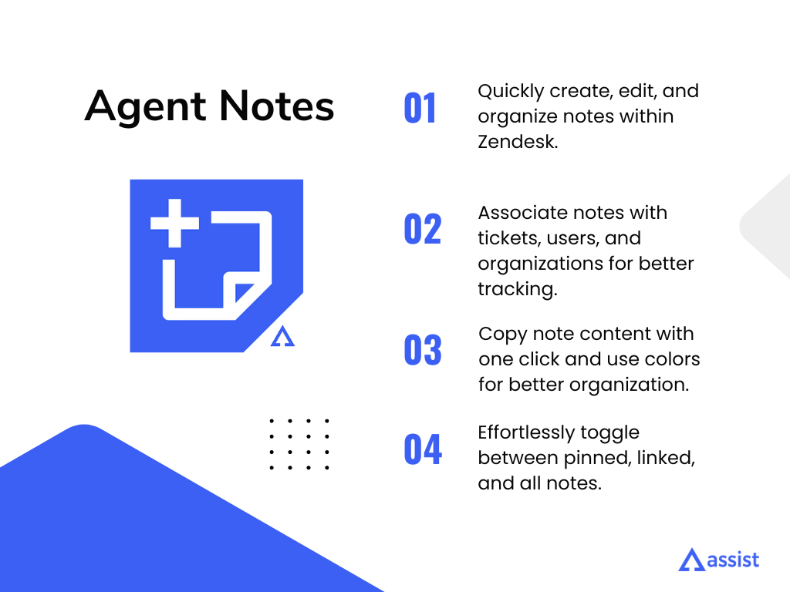
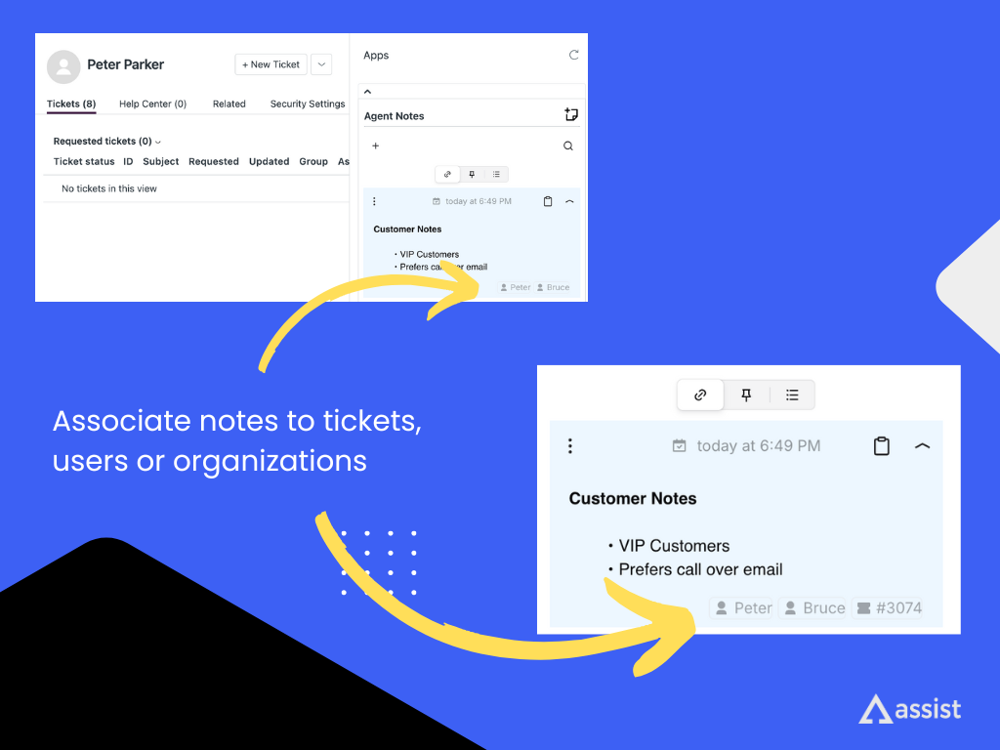
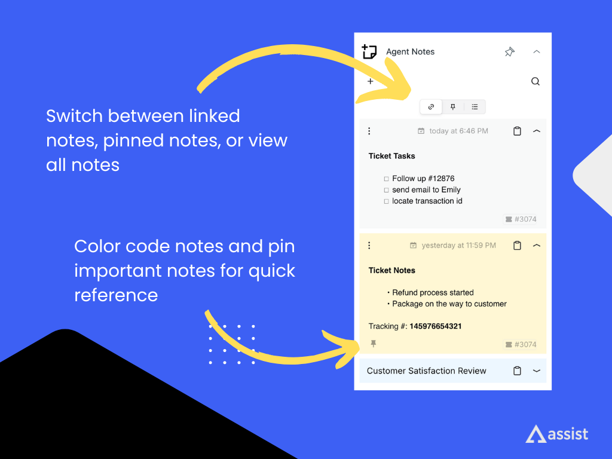

## Agent Notes

### Description

**Agent Notes** simplifies workflows by enabling agents to create, organize, and manage notes directly within Zendesk. With features like instant copying, color-coded notes, and the ability to link notes to tickets, users, and organizations, this app ensures agents can efficiently keep track of important details and stay organized.

### Key Features

- **Quick Note Creation**: Easily create notes within tickets for faster documentation.
- **Link Notes**: Associate notes with tickets, users, and organizations for better context.
- **Instant Copying**: Copy note content with a single click for easy sharing and reuse.
- **Color-Coded Notes**: Organize your notes with customizable colors to highlight priorities.
- **Accessible Anywhere**: Available in the ticket sidebar, user sidebar, organization sidebar, and top bar, ensuring quick access at any time.
- **Easy Management**: Edit, delete, or rearrange notes as needed, ensuring information is always up-to-date.
- **Pin Important Notes**: Pin crucial notes for quick reference.
- **Easy Switch Between Views**: Quickly toggle between pinned notes, linked notes, and all notes for efficient navigation.

### Benefits

- **Enhanced Productivity**: Save time by instantly creating and copying notes without leaving Zendesk.
- **Better Organization**: Use color coding to quickly identify and prioritize key information.
- **Improved Collaboration**: Share notes effortlessly to ensure team members stay informed. (Coming soon!)
- **Streamlined Workflows**: Reduce clutter and keep important details organized within tickets, users and organizations.
- **Template Responses**: Create reusable template responses for tickets, saving time on repetitive tasks.

### Installation

1. Visit the Zendesk Marketplace and find the Agent Notes app.
2. Click "Install" and follow the on-screen instructions.
3. Start creating notes and optimizing your workflow!

### Support
For assistance or questions, please contact our support team at hello@assistapps.co.

